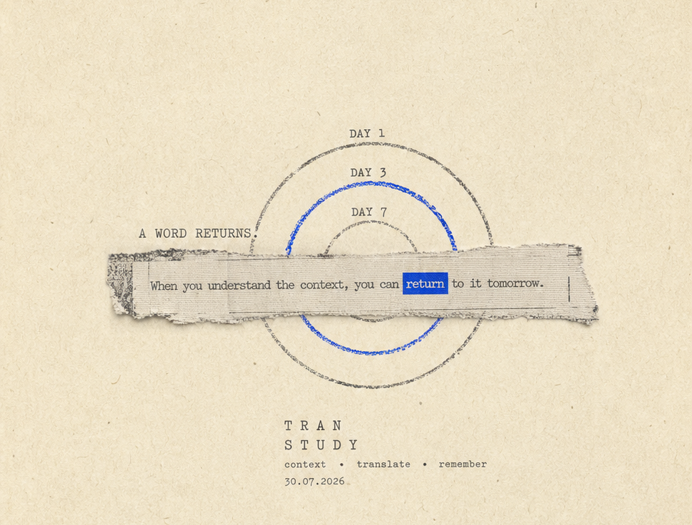

<p align="center">
  
</p>

<h1 align="center">TranStudy</h1>

<p align="center">
  在真实语境中遇见，在恰当时间再次记住。<br>
  Meet words in context. Remember them when the time is right.
</p>

<p align="center">
  <a href="#中文">中文</a> · <a href="#english">English</a>
</p>

## 中文

TranStudy 是一款原生 macOS 语境翻译与间隔复习应用。它把你在阅读中遇到的单词、短语和句子，从一次临时翻译变成可以持续积累和复习的学习内容。

### 下载与安装

前往 [GitHub Releases](https://github.com/cynicalight/TranStudy/releases)，在最新版本的 Assets 中下载以 `.dmg` 结尾的安装包。打开 DMG 后，将 TranStudy 拖入“应用程序”文件夹，然后从“应用程序”中启动。TranStudy 需要 macOS 14 或更高版本。

首次启动时，应用会引导你配置划词所需的辅助功能权限、翻译服务和可选的复习通知。你可以使用 DeepSeek，或填写自定义地址和模型来连接 OpenAI 兼容接口。

### 在语境中翻译

用鼠标选中文字后，TranStudy 会显示一个轻量的翻译入口。只有在你主动点击入口后，应用才会读取当前选区及必要上下文并请求翻译。你也可以通过可配置的全局快捷键翻译剪贴板内容，或在应用内翻译长文本。

### 从翻译到学习

翻译结果不会自动进入单词库。确认释义、发音和例句后，你可以选择“加入学习”，保留真实遇词语境。单词库支持搜索、编辑、自定义例句、归档、暂停复习和删除撤销。

### 在恰当时间复习

TranStudy 根据学习记录安排每日复习。卡片会先邀请你回忆，再通过“忘记”“困难”“记得”或“简单”记录记忆状态并调整之后的复习节奏。只有存在到期内容时，应用才会发送复习提醒。

### 隐私

API 密钥保存在 macOS 钥匙串中，学习记录保存在这台 Mac 上。TranStudy 只会把你明确请求翻译的文字发送给当前选择的翻译服务，不会在请求失败后自动转发给其他服务。密码框、受保护内容和无法确认安全属性的输入区域不会显示划词翻译入口。

### 从源码构建

源码构建需要 Xcode 26 或更高版本。只有在修改 `project.yml` 后重新生成 Xcode 工程时，才需要额外安装 XcodeGen 2.45 或更高版本。

```sh
xcodegen generate

xcodebuild build \
  -project TranStudy.xcodeproj \
  -scheme TranStudy \
  -destination 'platform=macOS' \
  CODE_SIGNING_ALLOWED=NO
```

运行完整测试：

```sh
xcodebuild test \
  -project TranStudy.xcodeproj \
  -scheme TranStudy \
  -destination 'platform=macOS' \
  CODE_SIGNING_ALLOWED=NO
```

## English

TranStudy is a native macOS app for contextual translation and spaced-repetition learning. It turns words, phrases, and sentences encountered while reading from one-off translations into learning material you can retain and revisit.

### Download and install

Visit [GitHub Releases](https://github.com/cynicalight/TranStudy/releases) and download the `.dmg` file from the Assets section of the latest release. Open the DMG, drag TranStudy into the Applications folder, and launch it from Applications. TranStudy requires macOS 14 or later.

On first launch, TranStudy guides you through the Accessibility permission used for selection translation, translation-service configuration, and optional review notifications. You can use DeepSeek or connect to an OpenAI-compatible endpoint with a custom base URL and model.

### Translate in context

After you select text with the mouse, TranStudy presents a lightweight translation entry point. The app reads the selection and its necessary context only after you explicitly click that entry point. You can also translate clipboard content with a configurable global shortcut or translate longer passages inside the app.

### Turn translations into learning

Translation results are never added to your library automatically. After reviewing the meaning, pronunciation, and examples, choose “Add to Learning” to preserve the real context in which you encountered the text. The library supports search, editing, custom examples, archiving, pausing reviews, and undoable deletion.

### Review at the right time

TranStudy schedules daily reviews from your learning history. Each card asks you to recall the answer before rating it as “Forgot,” “Hard,” “Remembered,” or “Easy,” then adjusts the future review rhythm. Review notifications are sent only when content is due.

### Privacy

API keys are stored in the macOS Keychain, and learning records remain on this Mac. TranStudy sends only text you explicitly ask to translate to the currently selected provider and never forwards it to another provider after a failure. Password fields, protected content, and inputs whose security cannot be verified never show the selection-translation entry point.

### Build from source

Building from source requires Xcode 26 or later. XcodeGen 2.45 or later is needed only when regenerating the Xcode project after changing `project.yml`.

```sh
xcodegen generate

xcodebuild build \
  -project TranStudy.xcodeproj \
  -scheme TranStudy \
  -destination 'platform=macOS' \
  CODE_SIGNING_ALLOWED=NO
```

Run the full test suite:

```sh
xcodebuild test \
  -project TranStudy.xcodeproj \
  -scheme TranStudy \
  -destination 'platform=macOS' \
  CODE_SIGNING_ALLOWED=NO
```
